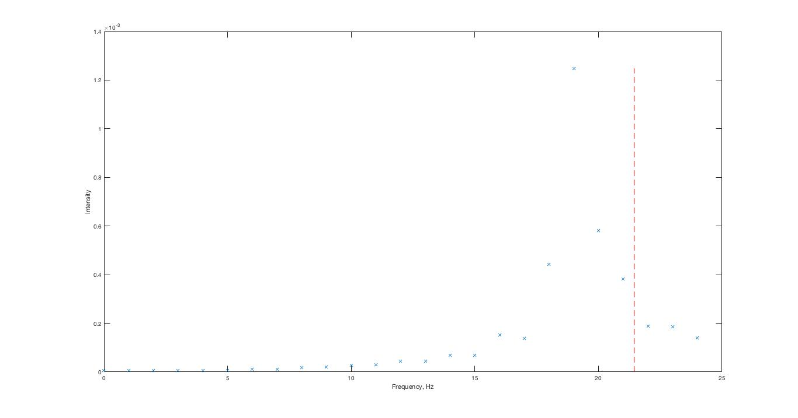
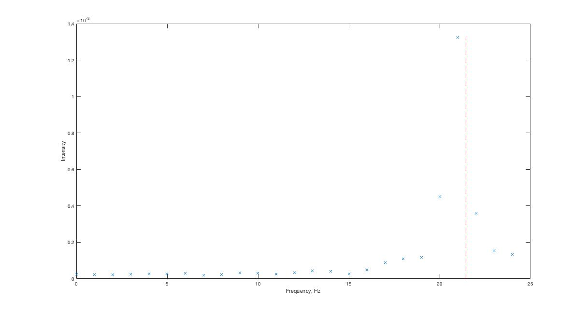

\maketitle

# Theoretical resonance frequency

According to the assignment, we had to define first resonance frequency for our beam. Thus, we had to consider coefficient $\alpha_0=1.875.$
And according to the formula for a resonance frequency we calculated:
$$\frac{1}{2\pi\sqrt{12}}\alpha_0^2\sqrt{\frac{E}{\rho}}\frac{h}{L^2}\approx21.4507...$$

# Frequency mode

For our frequency mode simulation we created three models with different size of meshes:

Also, for this mode we tried different types of integration: linear full and reduced, as well as quadratic full and reduced.
By this we wanted to see the influence of mesh AND type of integration.
For this mode, our results could be organised like this:

| Mesh                 | Linear reduced | Linear full | Quadratic reduced | Quadratic full |
|----------------------|----------------|-------------|-------------------|----------------|
| Robust               | -              | -           | 21.463            | 21.472         |
| Medium               | -              | 22.361      | 21.455            | 21.455         |
| Fine                 | 21.020         | 21.661      | 21.453            | 21.453         |

These methods yield relatively accurate results. For this mode making the size of mesh smaller does not influence the final result.
However, the method of integration definitely changes it.   The optimal method for computation of a more complex problem would be quadratic elements with reduced integration. (See Discussion).

# Impulse based analysis

To have a clear comparison of different modes, we decided to use the same three meshes as for frequency mode.
The obvious disadvantage of this method which we expectedly faced, is the time of simulation.
For the fine mesh, simulation takes approximately 5 minutes, which is unacceptable for this type of problems.

The meshes used for the impulse based analysis are show in figures \ref{robustmesh}, \ref{mediummesh}, and \ref{finemesh}

    

     

      

The results of the FFT in matlab are show in figures \ref{robustfft},\ref{mediumfft}, and \ref{finefft} with the expected value drawn in a red dashed line.

| Size of mesh: | Robust | Medium | Fine |
|---------------|--------|--------|------|
| Result:       | 19     | 19     | 21   |

The other disadvantage is that we get less accurate results.
This conclusion could be explained by two effects, which are connected with each other. 
First of all, we use quite a finite time step, for our simulation, which creates step like oscillation graph. 
The other thing is that we are using MATLAB function fft() which represents Fast Fourier Transform. 
This is very efficient algorithm to compute discrete Fourier transform. 
However, this type of Fourier transform of course produces further errors, which also influences results.
Some other effects of discretization come in to play here, see discussion.
The mesh quality also plays a significant role on this method as the fine mesh is the only one that appears to give an accurate result.

# Discussion

A few conclusions can be drawn from the above. We discussed that the optimal
elements in frequency based analysis are quadratic with reduced integration.
We know that quadratic elements typically are more accurate (except in special
cases), and we get nearly equivalent results with full integration for a more
expensive computation.  This makes sense as we have a bending beam with no
special restrictions that would draw a benefit from linear elements.  We do not
see the effects of shear locking or hourglassing in this mode. 

With the impulse based method we find inaccuracy for a few reasons.  It is discretizing the impulse data in the first place.  This gives us only n time samples to work with.  Once this is run through the fast Fourier transform algorithm in Matlab we then only get n discrete frequency samples out. Therefore our accuracy can only ever be expected to be as high as the difference between adjacent frequency samples.  So our fine mesh approximation is actually not that bad in this case.  As can be seen in figure \ref{finefft} it is within 1 frequency step from the expected theoretical value.  Improving the sampling in time space would yield better results, however this method is computationally expected.
The mesh quality plays a significant role in this method.  In general a finer mesh will yield a better results, but in this case it has a drastic effect.  Additionally, it utilizes linear elements which we determines were less accurate previously.  These effects are compounded by the error from the frequency step after the FFT as discussed above.

For finding the eigenfrequency of simple beams, we find that Abaqus
frequency mode is preferred. It is faster, it gives better results, and it is not so mesh depended as explicit method. To achieve results as close as possible to theoretically  calculated, of course finer meshes are preferred. However, in case of problems which might consume more time with fine meshes, a more robust could be used.
